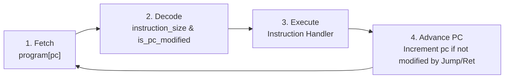

# MyLangVM - Stack-Based Bytecode Virtual Machine in C

A lightweight, high-performance **stack-based bytecode virtual machine** built from scratch in C. **MyLangVM** features a dual-stack runtime architecture (Evaluation Stack + Call Stack), variable-length opcode decoding, an instruction-mapping layer for non-linear control jumps, and subroutine calls (`CALL` / `RET`).

---

## 📋 Table of Contents
1. [Core Concepts](#-core-concepts)
   - [What is a Language Virtual Machine?](#what-is-a-language-virtual-machine)
   - [What is Bytecode?](#what-is-bytecode)
   - [Stack-Based vs. Register-Based VMs](#stack-based-vs-register-based-vms)
2. [Architecture & System Design](#-architecture--system-design)
   - [Dual-Stack Memory Model](#1-dual-stack-memory-model)
   - [Logical Instruction Mapping](#2-logical-instruction-mapping)
   - [Fetch-Decode-Execute Pipeline](#3-fetch-decode-execute-pipeline)
3. [Project Structure](#-project-structure)
4. [Instruction Set Architecture (ISA)](#-instruction-set-architecture-isa)
5. [Program Walkthrough](#-program-walkthrough)
6. [Build & Execution Guide](#-build--execution-guide)
7. [Extending MyLangVM](#-extending-mylangvm)
8. [License](#-license)

---

## 💡 Core Concepts

### What is a Language Virtual Machine?
A **Language Virtual Machine** (also known as a *Process VM*) is a software execution engine that emulates a computer system. Unlike **System Virtual Machines** (like QEMU or VirtualBox) which emulate an entire physical hardware platform and run guest operating systems, a Language VM is dedicated to executing a single application or compiled program bytecode.

Key examples of Language VMs include the **JVM** (Java Virtual Machine), **BEAM** (Erlang/Elixir), **V8** (JavaScript engine), and CPython.

---

### What is Bytecode?
**Bytecode** is a compact, low-level intermediate representation (IR) of program code designed for efficient execution by a virtual machine. 

```
[ High-Level Code ]  --->  ( Compiler / Assembler )  --->  [ Bytecode Stream ]  --->  ( MyLangVM Engine )
```

Rather than compiling directly to hardware-specific machine code (like x86_64 or ARM64), source code is compiled into bytecode opcodes. The VM reads these opcodes sequentially and executes their corresponding native operations.

---

### Stack-Based vs. Register-Based VMs

Language Virtual Machines generally fall into two architectural patterns:

| Feature | **Stack-Based VM (MyLangVM)** | **Register-Based VM (e.g., Lua VM)** |
| :--- | :--- | :--- |
| **Operand Location** | Values pushed/popped on an **Evaluation Stack** | Stored in explicit virtual registers (`R0`, `R1`...) |
| **Instruction Size** | Small (opcodes don't need register indices) | Larger (instructions encode source/destination registers) |
| **Compiler Complexity** | Very simple to generate bytecode for | Requires complex register allocation algorithms |
| **Example Addition** | `PSH 5`, `PSH 10`, `ADD` | `ADD R1, R2, R3` |

MyLangVM uses a **Stack-Based Architecture**, making it clean, modular, and ideal for learning compiler backends and virtual machine design.

---

## 🏗️ Architecture & System Design

MyLangVM consists of three core architectural components:

```
+-----------------------------------------------------------------------+
|                            MyLangVM Engine                            |
+-----------------------------------------------------------------------+
|  Program Counter (PC)  |  Logical Instruction Map Array (MapTable)   |
+------------------------+----------------------------------------------+
|   Evaluation Stack     |                Call Stack                    |
|   (operandStack)       |                (callStack)                   |
|   [ val0, val1, ... ]  |       [ return_address_0, ... ]              |
+------------------------+----------------------------------------------+
```

### 1. Dual-Stack Memory Model
To prevent data contamination between evaluation data and function execution flow, MyLangVM maintains two isolated stacks:
* **`operandStack`**: Holds intermediate calculation values, arithmetic operands, and comparison results.
* **`callStack`**: Dedicated return-address stack for function subroutines. When `CALL` executes, the raw return address (`pc + 2`) is pushed to `callStack`. When `RET` executes, it pops the address and restores `pc`.

---

### 2. Logical Instruction Mapping
In MyLangVM, opcodes can be:
* **1-Word Instructions** (1 element in bytecode stream, e.g., `ADD`, `SUB`, `RET`, `HLT`).
* **2-Word Instructions** (2 elements in bytecode stream, e.g., `PSH 1000`, `JMP 4`, `CALL 6`).

Because instructions vary in word length, raw array indices do not match logical instruction numbers. During `vm_init()`, the function `build_instruction_map()` scans the bytecode stream and creates `instructionMapArray`, which maps **0-based logical instruction indices** to raw array positions.

This allows jumps (`JMP`, `JZ`, `JNZ`, `CALL`) to target **logical instruction numbers** directly without needing hardcoded memory offsets.

---

### 3. Fetch-Decode-Execute Pipeline
The VM executes programs using a classic 4-step loop inside `vm_run()` / `vm_step()`:



---

## 📁 Project Structure

```
MyLangVM/
├── Makefile                      # Build system script (Clang/GCC)
├── README.md                     # Documentation
├── include/                      # Header Files Layer
│   ├── instruction.h             # Enum Opcodes & Instruction Helper declarations
│   ├── instruction_handlers.h    # Prototypes for opcode handler functions
│   ├── stack.h                   # Stack data structure & API declarations
│   └── vm.h                      # VM state structure & engine API
└── src/                          # C Source Implementation Layer
    ├── main.c                    # Main entry point & sample bytecode program
    ├── instruction.c             # Opcode sizes & PC modification predicates
    ├── instruction_handlers.c    # Handler implementations (execute_add, execute_call, etc.)
    ├── stack.c                   # Stack initialization, push, pop, and peek functions
    └── vm.c                      # VM lifecycle, instruction mapping, & loop engine
```

---

## 📜 Instruction Set Architecture (ISA)

MyLangVM supports **23 discrete opcodes**:

### 1. Stack Operations
| Opcode | Size | Stack Effect | Description |
| :--- | :---: | :--- | :--- |
| **`PSH <val>`** | 2 | `[] -> [val]` | Pushes immediate integer `<val>` onto `operandStack`. |
| **`POP`** | 1 | `[val] -> []` | Pops top element from `operandStack`. |
| **`DUP`** | 1 | `[val] -> [val, val]` | Duplicates top element of `operandStack`. |
| **`SWP`** | 1 | `[a, b] -> [b, a]` | Swaps top two elements of `operandStack`. |

### 2. Arithmetic & Unary Operations
| Opcode | Size | Stack Effect | Description |
| :--- | :---: | :--- | :--- |
| **`ADD`** | 1 | `[a, b] -> [a + b]` | Pops `b` and `a`, pushes `a + b`. |
| **`SUB`** | 1 | `[a, b] -> [a - b]` | Pops `b` and `a`, pushes `a - b`. |
| **`MUL`** | 1 | `[a, b] -> [a * b]` | Pops `b` and `a`, pushes `a * b`. |
| **`DIV`** | 1 | `[a, b] -> [a / b]` | Pops `b` and `a`, pushes `a / b` (exit on div by 0). |
| **`MOD`** | 1 | `[a, b] -> [a % b]` | Pops `b` and `a`, pushes `a % b`. |
| **`NEG`** | 1 | `[val] -> [-val]` | Negates top element if positive. |
| **`POS`** | 1 | `[-val] -> [val]` | Converts negative top element to positive. |

### 3. Comparison & Logical Operations
| Opcode | Size | Stack Effect | Description |
| :--- | :---: | :--- | :--- |
| **`GT`** | 1 | `[a, b] -> [a > b ? 1 : 0]` | Greater than comparison. |
| **`GE`** | 1 | `[a, b] -> [a >= b ? 1 : 0]` | Greater than or equal comparison. |
| **`EQ`** | 1 | `[a, b] -> [a == b ? 1 : 0]` | Equal to comparison. |
| **`NE`** | 1 | `[a, b] -> [a != b ? 1 : 0]` | Not equal to comparison. |
| **`LT`** | 1 | `[a, b] -> [a < b ? 1 : 0]` | Less than comparison. |
| **`LE`** | 1 | `[a, b] -> [a <= b ? 1 : 0]` | Less than or equal comparison. |

### 4. Control Flow & Subroutines
| Opcode | Size | Stack Effect | Description |
| :--- | :---: | :--- | :--- |
| **`JMP <target>`**| 2 | `[] -> []` | Unconditional jump to logical instruction `<target>`. |
| **`JZ <target>`** | 2 | `[cond] -> []` | Pops `cond`; jumps to `<target>` if `cond == 0`. |
| **`JNZ <target>`**| 2 | `[cond] -> []` | Pops `cond`; jumps to `<target>` if `cond != 0`. |
| **`CALL <target>`**| 2 | `[] -> []` | Pushes return address to `callStack`; jumps to `<target>`. |
| **`RET`** | 1 | `[] -> []` | Pops return address from `callStack` and restores `pc`. |
| **`HLT`** | 1 | `[] -> []` | Terminates VM execution cleanly. |

---

## 🏃 Program Walkthrough

Consider the following program defined in `src/main.c`:

```c
const int program[] = {
    // --- MAIN PROGRAM ---
    PSH, 1000,   // Inst #0: Push 1000
    PSH, 2000,   // Inst #1: Push 2000
    CALL, 6,     // Inst #2: Call subroutine at Inst #6 (push ret addr 6 to callStack)
    CALL, 10,    // Inst #3: Call subroutine at Inst #10 (push ret addr 8 to callStack)
    CALL, 14,    // Inst #4: Call subroutine at Inst #14 (push ret addr 10 to callStack)
    HLT,         // Inst #5: Halt execution

    // --- SUBROUTINE 1 (Inst #6) ---
    PSH, 3000,   // Inst #6
    PSH, 4000,   // Inst #7
    PSH, 5000,   // Inst #8
    RET,         // Inst #9: Return to main (restore pc = 6)

    // --- SUBROUTINE 2 (Inst #10) ---
    PSH, 6000,   // Inst #10
    PSH, 7000,   // Inst #11
    PSH, 8000,   // Inst #12
    RET,         // Inst #13: Return to main (restore pc = 8)

    // --- SUBROUTINE 3 (Inst #14) ---
    PSH, 9000,   // Inst #14
    PSH, 10000,  // Inst #15
    RET          // Inst #16: Return to main (restore pc = 10)
};
```

### Execution Log Output:
```text
The element is pushed : 1000    <-- operandStack
The element is pushed : 2000    <-- operandStack
The element is pushed : 6       <-- callStack (Return Address)
The element is pushed : 3000    <-- operandStack
The element is pushed : 4000    <-- operandStack
The element is pushed : 5000    <-- operandStack
The element is popped : 6       <-- callStack (RET restores pc to 6)
The element is pushed : 8       <-- callStack (Return Address)
The element is pushed : 6000    <-- operandStack
The element is pushed : 7000    <-- operandStack
The element is pushed : 8000    <-- operandStack
The element is popped : 8       <-- callStack (RET restores pc to 8)
The element is pushed : 10      <-- callStack (Return Address)
The element is pushed : 9000    <-- operandStack
The element is pushed : 10000   <-- operandStack
The element is popped : 10      <-- callStack (RET restores pc to 10)
```

---

## 🛠️ Build & Execution Guide

### Prerequisites
* **C Compiler**: `clang` or `gcc` supporting C11 (`-std=c11`).
* **Build Tool**: `make` (Unix/macOS) or `mingw32-make` (Windows).

---

### Building the Project

1. Open your terminal in the project directory:
   ```bash
   cd MyLangVM
   ```

2. Compile the project using `make`:
   ```bash
   make
   ```
   *This compiles all source files under `src/` with flags `-Wall -Wextra -g -std=c11 -Iinclude` and generates the binary executable `mylangvm`.*

---

### Running the Virtual Machine

* **On macOS / Linux**:
  ```bash
  ./mylangvm
  ```

* **On Windows (MinGW / Powershell)**:
  ```powershell
  .\mylangvm.exe
  ```

---

### Cleaning Build Artifacts

To remove compiled binary executables and object files:
```bash
make clean
```

---

## 🔧 Extending MyLangVM

To add a new instruction (e.g., `PRINT` or `NOP`):

1. **Add Opcode Enum**: Add the new opcode to `Instruction` enum in `include/instruction.h`.
2. **Set Size & Modifiers**: Declare size in `instruction_size()` and PC behavior in `is_pc_modified()` in `src/instruction.c`.
3. **Declare Handler**: Declare `void execute_your_opcode(VM *vm);` in `include/instruction_handlers.h`.
4. **Implement Handler**: Define execution logic in `src/instruction_handlers.c`.
5. **Add Case to Dispatcher**: Add a `case YOUR_OPCODE:` inside `vm_execute_instruction()` in `src/vm.c`.

---

## 📄 License

This project is licensed under the [GPL-3.0 License](LICENSE).
