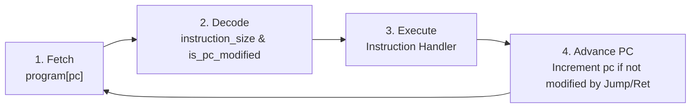

# MyLangVM - Stack-Based Bytecode Virtual Machine in C

A lightweight, high-performance **stack-based bytecode virtual machine** and accompanying toolchain built from scratch in C. **MyLangVM** features a dual-stack runtime architecture (Evaluation Stack + Call Stack), a 1024-word memory system, interactive I/O opcodes, variable-length opcode decoding, and an instruction-mapping layer for non-linear control jumps and subroutine calls (`CALL` / `RET`).

---

## 📋 Table of Contents
1. [Core Concepts](#-core-concepts)
   - [What is a Language Virtual Machine?](#what-is-a-language-virtual-machine)
   - [What is Bytecode?](#what-is-bytecode)
   - [Stack-Based vs. Register-Based VMs](#stack-based-vs-register-based-vms)
2. [Architecture & System Design](#-architecture--system-design)
   - [Dual-Stack & Memory Model](#1-dual-stack--memory-model)
   - [Logical Instruction Mapping](#2-logical-instruction-mapping)
   - [Fetch-Decode-Execute Pipeline](#3-fetch-decode-execute-pipeline)
3. [Project Directory Structure](#-project-directory-structure)
4. [Instruction Set Architecture (ISA)](#-instruction-set-architecture-isa)
5. [Assembler Toolchain (Coming Soon)](#-assembler-toolchain-coming-soon)
6. [Program Walkthrough](#-program-walkthrough)
7. [Build & Execution Guide](#-build--execution-guide)
8. [Extending MyLangVM](#-extending-mylangvm)
9. [License](#-license)

---

## 💡 Core Concepts

### What is a Language Virtual Machine?
A **Language Virtual Machine** (also known as a *Process VM*) is a software execution engine that emulates a computer system. Unlike **System Virtual Machines** (like QEMU or VirtualBox) which emulate physical hardware to run guest operating systems, a Language VM is dedicated to executing compiled program bytecode for a specific language runtime.

Key examples of Language VMs include the **JVM** (Java Virtual Machine), **BEAM** (Erlang/Elixir), **V8** (JavaScript engine), and CPython.

---

### What is Bytecode?
**Bytecode** is a compact, low-level intermediate representation (IR) of program code designed for efficient execution by a virtual machine. 

```
[ High-Level Code / Assembly ]  --->  ( Assembler )  --->  [ Bytecode Stream ]  --->  ( MyLangVM Engine )
```

Rather than compiling directly to hardware-specific machine code (like x86_64 or ARM64), source code is translated into bytecode opcodes. The VM reads these opcodes sequentially and executes their corresponding native C handlers.

---

### Stack-Based vs. Register-Based VMs

Language Virtual Machines generally fall into two architectural patterns:

| Feature | **Stack-Based VM (MyLangVM)** | **Register-Based VM (e.g., Lua VM)** |
| :--- | :--- | :--- |
| **Operand Location** | Values pushed/popped on an **Evaluation Stack** | Stored in explicit virtual registers (`R0`, `R1`...) |
| **Instruction Size** | Small (opcodes don't need register indices) | Larger (instructions encode source/destination registers) |
| **Compiler Complexity** | Simple & clean to generate bytecode for | Requires complex register allocation algorithms |
| **Example Addition** | `PSH 5`, `PSH 10`, `ADD` | `ADD R1, R2, R3` |

MyLangVM uses a **Stack-Based Architecture**, making it clean, modular, and ideal for understanding virtual machine runtimes and compiler backends.

---

## 🏗️ Architecture & System Design

MyLangVM consists of three core runtime pillars:

```
+-----------------------------------------------------------------------+
|                            MyLangVM Engine                            |
+-----------------------------------------------------------------------+
|  Program Counter (PC)  |  Logical Instruction Map Array (MapTable)   |
+------------------------+----------------------------------------------+
|   Evaluation Stack     |                Call Stack                    |
|   (operandStack)       |                (callStack)                   |
|   [ val0, val1, ... ]  |       [ return_address_0, ... ]              |
+------------------------+----------------------------------------------+
|                    RAM Memory Array: memory[1024]                      |
|                  [ STORE index / LOAD index access ]                  |
+-----------------------------------------------------------------------+
```

### 1. Dual-Stack & Memory Model
To prevent data contamination between evaluation data and function execution flow, MyLangVM maintains two isolated stacks plus a RAM array:
* **`operandStack`**: Holds intermediate calculation values, arithmetic operands, comparison results, and I/O inputs.
* **`callStack`**: Dedicated return-address stack for function subroutines. When `CALL` executes, the return address (`pc + 2`) is pushed to `callStack`. When `RET` executes, it pops the return address and restores `pc`.
* **`memory[1024]`**: A 1024-word RAM space accessible via `STORE <index>` and `LOAD <index>` opcodes.

---

### 2. Logical Instruction Mapping
In MyLangVM, opcodes can be:
* **1-Word Instructions** (1 element in bytecode stream, e.g., `ADD`, `SUB`, `INPT`, `PRNT`, `RET`, `HLT`).
* **2-Word Instructions** (2 elements in bytecode stream, e.g., `PSH 1000`, `JMP 4`, `CALL 6`, `STORE 0`, `LOAD 1`).

Because instructions vary in word length, raw array indices do not match logical instruction numbers. During `vm_init()`, `build_instruction_map()` scans the bytecode stream and constructs `instructionMapArray`, which maps **0-based logical instruction indices** to raw array positions.

This allows jump instructions (`JMP`, `JZ`, `JNZ`, `CALL`) to target **logical instruction numbers** directly without needing hardcoded memory byte offsets.

---

### 3. Fetch-Decode-Execute Pipeline
The VM executes programs using a classic 4-step loop inside `vm_run()` / `vm_step()`:



---

## 📁 Project Directory Structure

The repository is organized into modular sub-projects:

```
MyLangVM/
├── Makefile                      # Root build system script
├── README.md                     # Project documentation
├── LICENSE                       # GPL-3.0 License
├── common/                       # Shared Headers across modules
│   └── instruction.h             # Master Enum Opcodes (27 opcodes) & helper signatures
├── vm/                           # Virtual Machine Module
│   ├── Makefile                  # Build script for VM binary (mylangvm)
│   ├── include/                  # VM-specific Header Layer
│   │   ├── instruction_handlers.h # Prototypes for opcode handler functions
│   │   ├── stack.h               # Stack data structure & API declarations
│   │   └── vm.h                  # VM state structure (operandStack, callStack, memory)
│   └── src/                      # VM Implementation Layer
│       ├── main.c                # Main entry point & sample bytecode program
│       ├── instruction.c         # Opcode sizes & PC modification predicates
│       ├── instruction_handlers.c# Handler logic (execute_add, execute_store, etc.)
│       ├── stack.c               # Stack initialization, push, pop, & peek routines
│       └── vm.c                  # VM lifecycle, instruction mapping, & execution loop
└── assembler/                    # Assembler Toolchain Module [COMING SOON]
    ├── Makefile                  # Build script for Assembler binary
    ├── include/                  # Header directory (In Progress)
    └── src/                      # Source implementation directory (In Progress)
```

---

## 📜 Instruction Set Architecture (ISA)

MyLangVM supports **27 discrete opcodes**:

### 1. Stack Operations
| Opcode | Size | Stack Effect | Description |
| :--- | :---: | :--- | :--- |
| **`PSH <val>`** | 2 | `[] -> [val]` | Pushes immediate integer `<val>` onto `operandStack`. |
| **`POP`** | 1 | `[val] -> []` | Pops top element from `operandStack`. |
| **`DUP`** | 1 | `[val] -> [val, val]` | Duplicates top element of `operandStack`. |
| **`SWP`** | 1 | `[a, b] -> [b, a]` | Swaps top two elements of `operandStack`. |

### 2. Arithmetic & Unary Operations
| Opcode | Size | Stack Effect | Description |
| :--- | :---: | :--- | :--- |
| **`ADD`** | 1 | `[a, b] -> [a + b]` | Pops `b` and `a`, pushes `a + b`. |
| **`SUB`** | 1 | `[a, b] -> [a - b]` | Pops `b` and `a`, pushes `a - b`. |
| **`MUL`** | 1 | `[a, b] -> [a * b]` | Pops `b` and `a`, pushes `a * b`. |
| **`DIV`** | 1 | `[a, b] -> [a / b]` | Pops `b` and `a`, pushes `a / b` (exit on div by 0). |
| **`MOD`** | 1 | `[a, b] -> [a % b]` | Pops `b` and `a`, pushes `a % b`. |
| **`NEG`** | 1 | `[val] -> [-val]` | Negates top element if positive. |
| **`POS`** | 1 | `[-val] -> [val]` | Converts negative top element to positive. |

### 3. Comparison & Logical Operations
| Opcode | Size | Stack Effect | Description |
| :--- | :---: | :--- | :--- |
| **`GT`** | 1 | `[a, b] -> [a > b ? 1 : 0]` | Greater than comparison. |
| **`GE`** | 1 | `[a, b] -> [a >= b ? 1 : 0]` | Greater than or equal comparison. |
| **`EQ`** | 1 | `[a, b] -> [a == b ? 1 : 0]` | Equal to comparison. |
| **`NE`** | 1 | `[a, b] -> [a != b ? 1 : 0]` | Not equal to comparison. |
| **`LT`** | 1 | `[a, b] -> [a < b ? 1 : 0]` | Less than comparison. |
| **`LE`** | 1 | `[a, b] -> [a <= b ? 1 : 0]` | Less than or equal comparison. |

### 4. Control Flow & Subroutines
| Opcode | Size | Stack Effect | Description |
| :--- | :---: | :--- | :--- |
| **`JMP <target>`**| 2 | `[] -> []` | Unconditional jump to logical instruction `<target>`. |
| **`JZ <target>`** | 2 | `[cond] -> []` | Pops `cond`; jumps to `<target>` if `cond == 0`. |
| **`JNZ <target>`**| 2 | `[cond] -> []` | Pops `cond`; jumps to `<target>` if `cond != 0`. |
| **`CALL <target>`**| 2 | `[] -> []` | Pushes return address to `callStack`; jumps to `<target>`. |
| **`RET`** | 1 | `[] -> []` | Pops return address from `callStack` and restores `pc`. |

### 5. Memory & I/O Operations
| Opcode | Size | Stack Effect | Description |
| :--- | :---: | :--- | :--- |
| **`STORE <idx>`** | 2 | `[val] -> []` | Pops `val` and stores it at `memory[idx]`. |
| **`LOAD <idx>`**  | 2 | `[] -> [val]` | Copies `memory[idx]` and pushes it to `operandStack`. |
| **`INPT`**        | 1 | `[] -> [input]` | Prompts user for integer input via stdin and pushes it. |
| **`PRNT`**        | 1 | `[val] -> []` | Pops `val` from `operandStack` and prints it to stdout. |
| **`HLT`**         | 1 | `[] -> []` | Terminates VM execution cleanly. |

---

## 🛠️ Assembler Toolchain (Coming Soon)

Work has begun on an **Assembler Toolchain** (`assembler/` directory). The assembler will parse human-readable `.mylang` assembly files (containing mnemonics, labels, and arguments) and compile them into binary bytecode files executable by **MyLangVM**.

Stay tuned for updates! 🚀

---

## 🏃 Program Walkthrough

Consider an interactive program in `vm/src/main.c`:

```c
const int program[] = {
    INPT,   // Prompts user for 1st number, pushes to operandStack
    INPT,   // Prompts user for 2nd number, pushes to operandStack
    ADD,    // Pops both numbers, adds them, pushes sum
    PRNT,   // Pops sum and prints to console
    HLT     // Halts execution
};
```

### Console Run:
```text
Enter the value : 15
The element is pushed : 15
Enter the value : 25
The element is pushed : 25
The element is popped : 25
The element is popped : 15
The element is pushed : 40
The element is popped : 40
40
```

---

## 🛠️ Build & Execution Guide

### Prerequisites
* **C Compiler**: `clang` or `gcc` supporting C11 (`-std=c11`).
* **Build Tool**: `make` (Unix/macOS) or `mingw32-make` (Windows).

---

### Building and Running the VM

1. Navigate to the `vm/` sub-directory:
   ```bash
   cd vm
   ```

2. Compile using `make`:
   ```bash
   make
   ```
   *This compiles `vm/src/*.c` using `-Iinclude -I../common` and outputs the executable `mylangvm`.*

3. Run the virtual machine:
   * **macOS / Linux**:
     ```bash
     ./mylangvm
     ```
   * **Windows (MinGW)**:
     ```powershell
     .\mylangvm.exe
     ```

4. Clean build artifacts:
   ```bash
   make clean
   ```

---

## 🔧 Extending MyLangVM

To add a new instruction (e.g., `BIT_AND` or `BIT_OR`):

1. **Update Common Header**: Add the opcode to `Instruction` enum in `common/instruction.h`.
2. **Update Opcode Size & Modifiers**: Declare size in `instruction_size()` and PC modification flag in `is_pc_modified()` in `vm/src/instruction.c`.
3. **Declare Handler Prototype**: Add `void execute_your_opcode(VM *vm);` in `vm/include/instruction_handlers.h`.
4. **Implement Handler**: Define execution logic in `vm/src/instruction_handlers.c`.
5. **Add Switch Case**: Add `case YOUR_OPCODE:` inside `vm_execute_instruction()` in `vm/src/vm.c`.

---

## 📄 License

This project is licensed under the [GPL-3.0 License](LICENSE).
